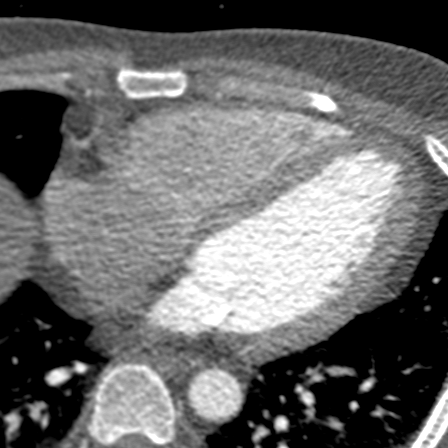
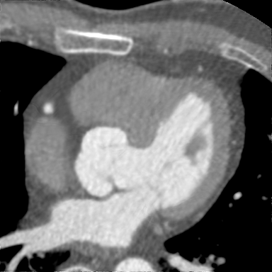
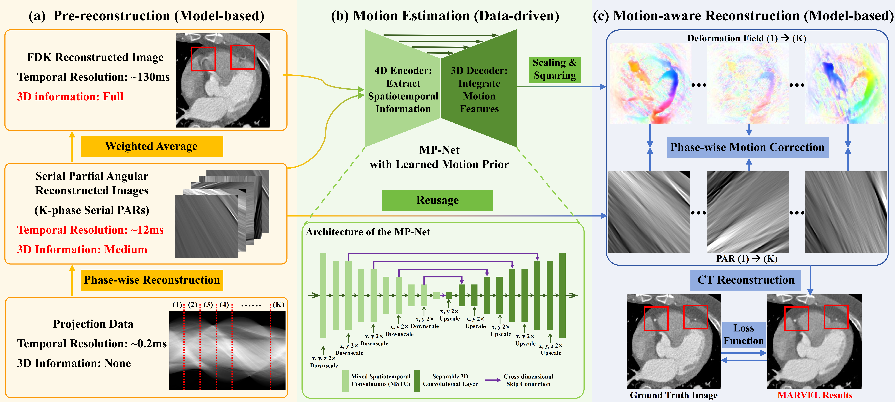

# MARVEL: Motion-aware reconstruction via embedded Learning of Motion Prior for Cardiac CT

Author: Ziheng Deng, Jun Zhao, School of BME, Shanghai Jiao Tong University

This repository is the official implementation of MARVEL: Motion-aware reconstruction via embedded Learning of Motion Prior for Cardiac CT. In this paper, we introduce a novel framework for motion artifact reduction that synergistically embeds a data-driven motion estimation model into traditional model-based reconstruction method.

Code and pretrained model will be available after the paper is published.

## Demo

Here are some examples of our motion artifact reduction algorithm tested on __*real clinical CT scans*__. The cardiac CT data were collected from a 320-row CT scanner in axial scan mode. Each scan roughly covers a whole cardiac cycle.

*Note: All visualizations are copyright protected. Contact the author for high-resolution versions or reuse permissions.*

### Dynamic results in axial view

|             Case             |                 Case1                 |                 Case2                 |                 Case3                 |
| :--------------------------: | :-----------------------------------: | :-----------------------------------: | :-----------------------------------: |
| Short-scan FDK (uncorrected) |  |  |  |
|        MARVEL Results        |  |  |  |

### Dynamic results in coronal and sagittal views

The MARVEL framework works in 3D/4D, thus natively provides consistent and natural 3D motion. You may also notice that the MARVEL also reveals the respiratory motion for case 2, where the patient failed to hold the breath.

*Note: We suppressed the cone-beam artifacts via a simple post-processing neural network to better demonstrate the dynamic reconstruction results.*

|         Case         |                 Case1                 |                 Case2                 |                 Case3                 |
| :------------------: | :-----------------------------------: | :-----------------------------------: | :-----------------------------------: |
| MARVEL Coronal View  |  |  |  |
| MARVEL Sagittal View |  |  |  |

### 4D results
We use the [TotalSegmentator](https://github.com/wasserth/TotalSegmentator) to perform automatically image segmentation for both heart chambers and coronary arteries. Without motion correction, the cardiac motion is inconsistent. This is why 4D cardiac CT is seldomly used in clinical (they use cine cardiac MR). With the MARVEL method, we are able to reveal the real cardiac motion patterns with high spatial resolution.
#### Case 1

| Chambers / Coronary Arteries |               Chambers                |    Coronary Arteries (Front View)     | Coronary Arteries (Back View)         |
| :--------------------------: | :-----------------------------------: | :-----------------------------------: | ------------------------------------- |
| Short-scan FDK (uncorrected) |  |  |  |
|        MARVEL Results        |  |  |  |

#### Case 2
| Chambers / Coronary Arteries |               Chambers                |    Coronary Arteries (Front View)     | Coronary Arteries (Back View)         |
| :--------------------------: | :-----------------------------------: | :-----------------------------------: | ------------------------------------- |
| Short-scan FDK (uncorrected) |  |  |  |
|        MARVEL Results        |  |  |  |

## MARVEL Workflow

